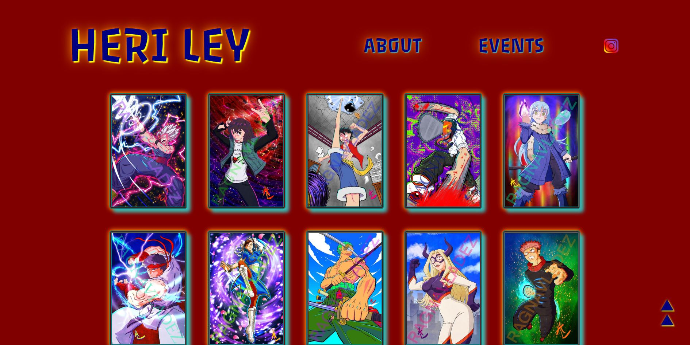
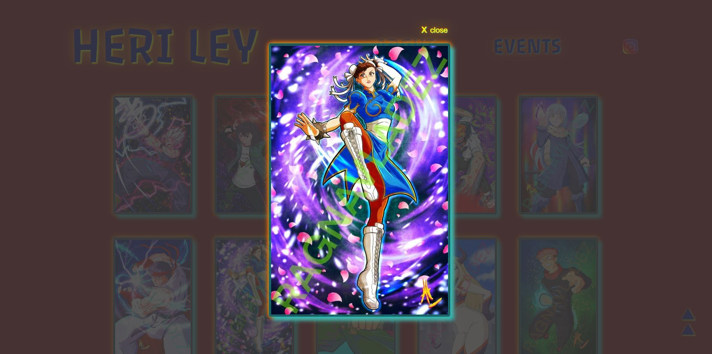
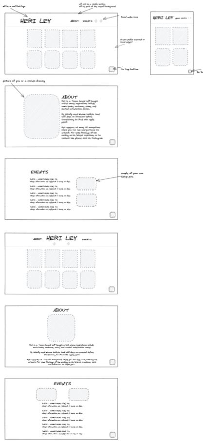
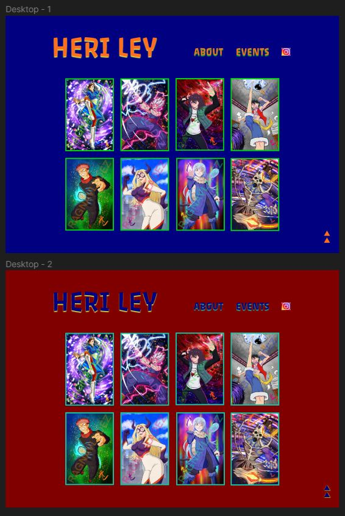

# Website for artist Heri Ley

[Visit the site](https://heri-ley.netlify.app/)

## Screenshots

Gallery:

Exhibit modal:

## The Project

I've been friends with Heri for a while, having met via our mutual love of karaoke (of all things!) on the mobile app, Smule. Knowing he's such a talented artist, I actually asked if he wouldn't mind making me some art for a project I'm working on, and this made me wonder if he'd like a site to showcase his work.

I put together a couple of different low-fi wireframe designs in Excalidraw, and sent these along with some colour and font options to Heri for his opinions - before producing high-fi wireframes in Figma based on the outcomes of those decisions.

 

The colours and style choices reflect the nature and vibrancy of Heri's art, but simultaneously allow it to stand out as the main focus of the site.

## The Build

The design was different to other projects I've worked on in that it's a purely single-page application with the navbar links navigating to sections of the same page, achieved with simple HTML navigation based on element ids.  I opted not to implement smooth scrolling as I personally find this somewhat of an accessibility issue, having a vestibular balance disorder.

Keeping in mind that I wanted Heri to be able to update the site easily by himself, my main concerns were making the gallery exhibits easy to add to/update, as well as the events. To this end, both are stored in simple arrays that are then mapped through to produce the respective components - so updating is simply a matter of adding/removing an item to an array in an established format.

The app is responsive and optimised for different viewports, as people meeting Heri at conventions are likely to use their phones in the first instance to view his site, but other artists might be more likely to visit via tablet/desktop, so this was a key consideration.

## Tech

React, CSS, JavaScript, HTML, Netlify

## Some Thoughts

Having a 'client' as such was really good for not only focussing my attention to very specific needs, but also made for a really interesting collaboration on a different level to that which I've been exposed to previously. I really enjoyed the element of delivering something for a real 'customer' :smile:
